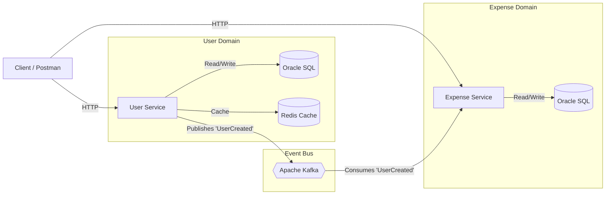

# SplitPay – Distributed Expense Sharing Microservices


**SplitPay** is a high-performance backend system designed for distributed expense sharing, wallet management, and real-time event processing.  
Built using **Spring Boot Microservices**, **Apache Kafka**, **Redis**, **Oracle SQL**, and **Docker**, fully deployable on **AWS EC2**.

---

## 🏗 System Architecture

The system uses **Database per Service**, **Event-Driven Architecture**, and **asynchronous communication via Kafka**.

### Architecture Diagram



---

## 🚀 Key Features

- **Microservices Architecture** — independent User & Expense services.
- **Kafka Event-Driven System** — async propagation of user creation → wallet provisioning.
- **Redis Caching** — L2 cache for high-speed lookups.
- **Oracle SQL** — Transaction-safe persistent storage.
- **Feature Flags** — Redis-backed toggles for dynamic behavior.
- **Observability** — Prometheus + Grafana dashboards.
- **AWS Deployable** — Optimized for EC2 Free Tier (t3.micro).

---

## 🛠 Tech Stack

| Category      | Technology               | Purpose                                |
|---------------|--------------------------|----------------------------------------|
| Language      | Java 17                  | Core backend logic                     |
| Framework     | Spring Boot 3.x          | REST APIs, DI, ORM, Actuator           |
| Database      | Oracle SQL (XE 18c)      | Persistent storage                     |
| Messaging     | Apache Kafka             | Async events, decoupling               |
| Cache         | Redis                    | Caching + Feature Flags                |
| DevOps        | Docker + Docker Compose  | Container orchestration                |
| Monitoring    | Prometheus + Grafana     | Metrics & Visualization                |
| Cloud         | AWS EC2 (t2.micro)       | Deployment                             |

---

## 🔌 API Endpoints & Port Mapping

| Service          | Port | Description                     |
|------------------|------|---------------------------------|
| User Service     | 8080 | User management & Auth          |
| Expense Service  | 8081 | Wallet & Transactions           |
| Grafana          | 3000 | Monitoring Dashboard            |
| Prometheus       | 9090 | Metrics scraping                |
| Oracle DB        | 1521 | Database access                 |

---

## 📦 Sample API Requests

### 1. Create User (Triggers Kafka Event)

```bash
curl -X POST http://localhost:8080/user/create \
     -H "Content-Type: application/json" \
     -d '{"username": "jdoe", "email": "john@splitpay.com", "phoneNumber": "123456"}'
```

### 2. Get User (Uses Redis Cache)

```bash
curl -X GET http://localhost:8080/user/1
```

### 3. Toggle Feature Flag

```bash
curl -X POST http://localhost:8080/user/feature/strict-email-validation/true
```

---

## ⚙️ Setup & Installation

### Prerequisites
- Docker & Docker Compose
- Java 17 (only needed if not using Docker)

---

## ▶️ Option 1 — Run Entire Stack With Docker (Recommended)

### Clone Repository
```bash
git clone https://github.com/imbaggarwal/SplitPay-Backend.git
cd SplitPay-Backend
```

### Build JARs

**Windows**
```bash
cd user-service && ..\mvnw clean package -DskipTests
cd ..\expense-service && ..\mvnw clean package -DskipTests
cd ..
```

**Mac/Linux**
```bash
cd user-service && ./mvnw clean package -DskipTests
cd ../expense-service && ./mvnw clean package -DskipTests
cd ..
```

### Start Docker Services

```bash
docker-compose up -d --build
```

### Verify Services

Check Oracle logs:
```bash
docker logs -f splitpay-db
```

Open Grafana:
- URL: **http://localhost:3000**
- Login: **admin / admin**

---

## ☁️ Option 2 — Deploy on AWS EC2 (Free Tier)

- Uses lightweight Oracle image: `gvenzl/oracle-xe:18-slim`
- Adds `ipc: host` to fix ORA-27104 shared memory issue
- Works on **1 GB RAM** t3.micro

---

## 📈 Monitoring (Prometheus + Grafana)

- Actuator + Micrometer enabled
- Import **Grafana Dashboard ID: 4701 (JVM Micrometer)**

Metrics available:
- JVM Heap/GC
- Request latency
- CPU usage
- Kafka lag

---

## 🐛 Troubleshooting

### Oracle DB — ORA-27104 Shared Memory Error
- Occurs due to Docker SHM limits  
  Fix:
- Add `ipc: host` to DB service in docker-compose OR
- Increase `/dev/shm` size in Docker settings.

### Kafka “Connection Refused”
Kafka takes **~45 seconds** to initialize.  
Docker will restart dependent services automatically.

---

## 👨‍💻 Author

Built by **Bhavya Aggarwal** as a cloud-native distributed systems project.

---

